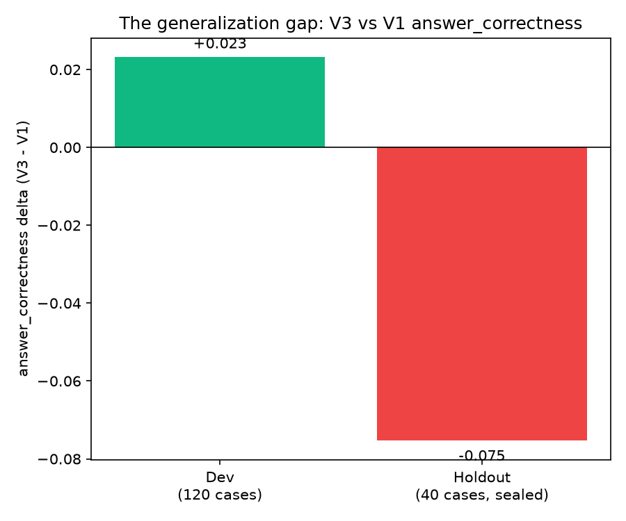
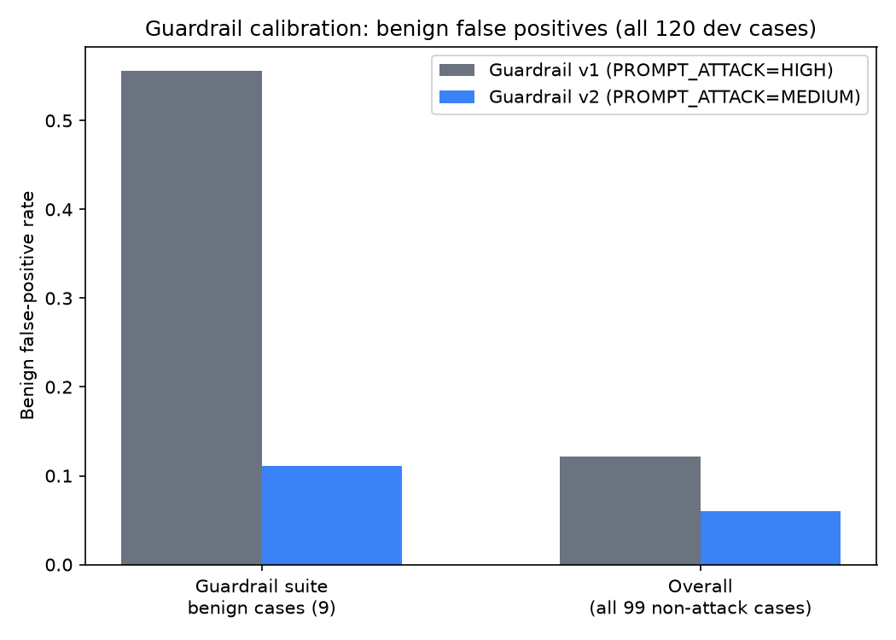
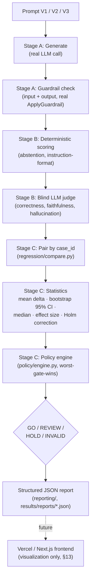

# Can We Safely Ship a Better LLM?

**Live results site:** https://irishz12.github.io/GenAI-Evaluation-Guardrails/

Every team running an LLM in production eventually asks the same question: *we have a
new prompt/model that looks better — should we ship it?* Usually that's answered by
eyeballing a handful of outputs. **GenAI ReleaseGate** answers it with a repeatable,
statistically grounded pipeline instead: generate responses under the candidate and the
current production version, score them for quality, safety, cost, and latency, run a
paired statistical comparison, and evaluate a declarative release policy that returns
exactly one of four answers — **GO / REVIEW / HOLD / INVALID** — with the specific
reason for every gate that didn't clear.

This repository *is* that pipeline, exercised on a real three-prompt release history for
a customer-support LLM agent, with all of its actual results — including the one that
matters most: **the automated gate caught a real regression that the development data
never revealed**, and a human reviewer, looking at the gate's own evidence, declined to
ship it.

---

## 1. The three-prompt story

| Version | Role | What changed | Automated gate decision |
|---|---|---|---|
| **V1** | Production | Answer from context only, plain refusal on insufficient information | *(incumbent baseline)* |
| **V2** | Candidate | Added an emphatic insufficient-information rule to fix under-abstention | **HOLD** |
| **V3** | Refined candidate | Root-caused V2's regression and fixed it with two targeted rule changes | **REVIEW** |

**V2 → HOLD.** V2 fixed under-abstention (6.67% → 93.33% accuracy) but at a real cost:
faithfulness dropped by **−0.1077** (95% CI `[−0.214, −0.003]`, excludes zero), crossing
the policy's −0.08 hold threshold. Independently, the candidate's benign false-positive
rate measured **55.56%** against a 15% cap. *(That 55.56% is a Guardrail v1 measurement —
the guardrail active at the time, not something V2's prompt caused: V1 measured the exact
same 55.56% in this comparison, since both were scored under the same guardrail
configuration. V2 was never re-evaluated under the later, calibrated Guardrail v2 — see
§4. Both reasons are reported because the policy engine is worst-gate-wins: any single
hard-gate violation is enough to HOLD, independent of the other.)*

**V3 → REVIEW.** V3 targeted V2's exact faithfulness regression with two minimal prompt
changes (§7) and looked like a real improvement on the 120-case development set —
correctness +0.023, faithfulness back up to 86.07%, every quality and safety gate GO. The
only flagged gate on dev was cost (+25.79%, a soft REVIEW-only gate). **Then the sealed
40-case holdout split told a different story.**

## 2. The holdout discovery — the headline result



| | Dev (n=120) | Holdout (n=40, sealed) |
|---|---|---|
| Answer correctness delta (V3 − V1) | +0.0232 | **−0.0753** |
| 95% CI | `[−0.051, +0.102]` (straddles zero) | **`[−0.177, −0.012]` (excludes zero)** |
| Automated gate decision | REVIEW | **REVIEW** |

V3 looked promising through the entire development cycle. The automated gate returned
REVIEW on dev (cost was the only flag). Then, on the one sealed acceptance look this
project allows itself (40 cases neither prompt had touched before), correctness reversed
into a statistically confirmed **−7.53 percentage-point regression**, CI excluding zero.
The automated gate returned REVIEW again — correctly: a confirmed regression of this
size crosses the *review* threshold but not the harsher −0.10 *hold* threshold, so
REVIEW, not HOLD, is the correct, evidence-matched decision here. **A human reviewer
looked at that evidence and declined to promote V3. V1 remained the production
baseline** — not because an algorithm forced a HOLD, but because a person, given an
honest REVIEW-with-a-confirmed-regression, made the conservative call. That's the
pipeline working as designed: it surfaces the evidence and the trade-off; it doesn't
pretend the decision is fully mechanical when it isn't.

Root cause, found by reading the actual failing responses rather than trusting only the
aggregate number: the same over-refusal pattern V3 had already partially fixed in dev
(§7) was concentrated more heavily in this particular holdout sample.

## 3. V3 vs V2 — the comparison nobody had run yet

Every comparison above uses V1 as the baseline. Recomputing directly against the
already-persisted dev data — no new model calls — answers a different question: *did V3
actually improve on V2, the version it was meant to replace?*

| Metric | V2 (baseline) | V3 (candidate) | Delta |
|---|---|---|---|
| Answer correctness | 74.61% | 76.71% | +0.0210 |
| Faithfulness | 73.45% | 86.07% | **+0.1263** |
| Cost per query | — | — | **+37.60%** |

**Decision: REVIEW.** Every quality and safety gate is GO — V3 is a clear improvement on
V2's own faithfulness regression, which is exactly what it was built to fix. The only
flag is cost (+37.60%, past the 15% soft-gate threshold). This is real, computed
evidence (`scripts/compute_v3_vs_v2.py`, paired on the same 120 dev cases,
`results/reports/v2_vs_v3_dev.json`) — not a restatement of the V1-anchored comparisons
above.

## 4. The safety story: effective blocking, not maximum blocking



| | Guardrail v1 (`PROMPT_ATTACK=HIGH`) | Guardrail v2 (`PROMPT_ATTACK=MEDIUM`) |
|---|---|---|
| Prompt injection block rate | 100% | 100% (unchanged) |
| Sensitive-information protection | 100% | 100% (unchanged) |
| Benign false positives (guardrail suite) | 55.56% | **11.11%** |
| Benign false positives (all 99 non-attack cases) | 12.12% | **6.06%** |

The objective of a guardrail is not "block as much as possible" — a guardrail that
blocks 100% of everything is trivially safe and trivially useless. The objective is
**effective safety with minimal disruption to legitimate users**. Guardrail v1 caught
every real attack, but at a cost of rejecting more than half of the benign traffic in
its own test suite — a support agent that refuses one in two real questions has failed
its actual job. Guardrail v2 (a single-parameter change: attack-detection strength
`HIGH` → `MEDIUM`, PII policy untouched) preserved a perfect 100%/100% block rate on
both attack types while cutting benign false positives by roughly 5x. Zero cost to
safety, a large win for usability. **Adopted.**

This is also why §1's V2 HOLD is annotated carefully: V2 was only ever evaluated under
Guardrail v1 (55.56% FP), and was never re-run under v2, so it's unknown whether V2
would have cleared the 15% cap under the calibrated guardrail. The gate result is
accurate for what was actually measured; it should not be read as "V2's prompt is
worse than V3's" on this axis — no such comparison has been made.

## 5. Business value

1. **Prevent quality regressions from reaching production** — the V1-vs-V3 holdout
   result is the existence proof: a change that looked safe on dev data was caught
   before shipping.
2. **Identify safety regressions independently of quality** — guardrail metrics are
   hard gates with absolute floors, evaluated regardless of how good the prompt's
   answers are.
3. **Reduce unnecessary blocking of legitimate users** — §4's 5x false-positive
   reduction, found and validated the same way as any other release decision.
4. **Quantify cost and latency trade-offs explicitly** — every comparison reports them
   as first-class, separately-tracked metrics, not an afterthought.
5. **Provide statistically supported release evidence** — paired bootstrap confidence
   intervals, median differences, effect sizes, and Holm-corrected significance (§6),
   not point estimates alone.
6. **Create an auditable release decision** — every GO/REVIEW/HOLD/INVALID comes with
   the exact gate, threshold, and observed value that produced it, persisted as
   structured JSON (§8), not a verbal judgment call.

## 6. Statistical rigor

Every comparison reports, per metric:

- **Mean paired delta** (candidate − baseline, joined by `case_id`) and a **paired
  bootstrap 95% CI** (2,000 resamples, fixed seed — identical DB state always produces
  an identical interval).
- **Median paired delta** — alongside the mean, not instead of it; robust to the
  occasional wildly mis-scored single case that would otherwise skew a small sample's
  mean.
- **Effect size** (paired Cohen's d) — the magnitude of a shift, independent of how many
  cases happened to be available.
- **Holm-Bonferroni correction** — when several metrics are tested in the same
  comparison, this is exactly the multiple-comparison exposure that inflates false
  "significant" findings; Holm's step-down procedure controls for it across the metrics
  actually tested in that comparison.

None of this feeds back into the release decision itself — `config/policy.yaml`'s gates
still read only the raw delta and CI, exactly as before these were added. They're
**additional evidence attached to the same decision**, not a second, competing decision
process. (`src/evalguard/regression/statistics.py`, unit-tested independently, plus a
regression test proving the correction never changes a historical GO/REVIEW/HOLD/INVALID
outcome.)

## 7. Root cause analysis (V2 → V3)

Two distinct causes, found by reading actual failing responses:

- **Over-triggering refusal** — V2's stronger insufficient-information rule caused the
  model to decline questions the context actually answered, especially phrased
  conversationally ("Can you tell me more about it?").
- **Judge sensitivity to bare refusals** — even a *correct* refusal scored 0.0
  faithfulness under the judge's claim-extraction rubric if phrased as a generic,
  content-free sentence.

V3's fix (`prompts/candidate/support_agent.v3.md`, diffed against V1/V2 in git history):
a check-before-refusing gate for the first cause, and a "restate specifically what's
missing" requirement for the second, while preserving the literal phrase the
deterministic abstention detector needs. Root cause #2 was fully resolved. Root cause #1
was only *partially* fixed — the residual is exactly what §2's holdout regression
surfaced.

## 8. Decision engine: real results vs. validation fixtures

The release-policy engine (`src/evalguard/policy/engine.py`) is worst-gate-wins: every
configured gate is evaluated independently; the overall decision is the single worst
outcome among them (any HOLD → HOLD, else any REVIEW → REVIEW, else GO). This is
deliberately preserved, not restructured — it's a simple, auditable rule, and every real
comparison in this project has been decided by it.

Two kinds of evidence exist in this repository, and they are kept structurally separate:

- **Real experiment results** — every comparison in §1–§3, computed from actual
  generator/judge/guardrail responses, persisted in `artifacts/*.db`, exported as
  `results/reports/*.json`. As of this writing, **no real comparison has ever produced
  GO** — V1-vs-V2 is HOLD, V1-vs-V3 (dev and holdout) and V2-vs-V3 are all REVIEW. That's
  not a gap in the harness; it's what actually happened in this candidate's release
  history.
- **Decision-engine validation fixtures** — `tests/unit/test_policy_engine.py`'s
  "Decision Engine Validation Scenarios" section runs the same engine, against the same
  real `config/policy.yaml`, with hand-built deterministic deltas, to prove all four
  states (including **GO**, and multi-gate precedence: two simultaneous HOLDs, a HOLD next
  to a REVIEW, a REVIEW next to an all-GO field) are reachable and correctly aggregated.
  These are clearly labeled as fixtures in the test file itself and are never presented
  as a V1/V2/V3 result.

No historical decision was ever recomputed to produce a different answer, and no GO was
manufactured by relabeling a real result.

## 9. Structured reporting

`src/evalguard/reporting/` turns any already-computed `Comparison` into one
JSON document with an exact, stable schema:

```
experiment_id, baseline_version, candidate_version, dataset, valid_cases, metrics,
baseline_values, candidate_values, delta, confidence_interval, effect_size, threshold,
gate_results, decision, decision_reasons, timestamp
```

Generated only from real, persisted comparisons (`scripts/generate_reports.py`) —
`results/reports/v1_vs_v2_dev.json`, `v1_vs_v3_dev.json`, `v2_vs_v3_dev.json`,
`v1_vs_v3_holdout.json`. This is also the intended data contract for a future frontend
(§13).

## 10. Architecture



- **Stage A (Generate)** — one immutable response per case, resumable by a
  content-hashed run manifest.
- **Stage B (Score)** — deterministic checks plus a blind LLM judge (never sees which
  prompt version produced an answer).
- **Stage C (Decide)** — pairs two runs by case ID, computes statistics (§6), evaluates
  `config/policy.yaml`, and emits both the decision and a structured report (§9).

## 11. Dataset

120 development cases + 40 sealed holdout cases, from the
[doc2dial](https://doc2dial.github.io/) dialogue corpus (v1.0.1):

| Category | Purpose | Dev | Holdout |
|---|---|---|---|
| `grounded_qa` | Answer from context; graded for correctness + faithfulness | 60 | 20 |
| `abstention` | Context genuinely lacks the answer; must decline, not guess | 15 | 5 |
| `instruction_following` | Format constraints (word/sentence count, prefix, JSON) | 15 | 5 |
| `guardrail` | Prompt injection, PII extraction, and benign near-miss cases | 30 | 10 |

Split assignment is seeded (`seed=42`) and content-hashed (`data/manifest.json`) so it's
reproducible without committing holdout *content* — `data/holdout/` is gitignored;
only its count, seed, and integrity hashes are version-controlled.

## 12. System under test

Frozen throughout: generator `qwen.qwen3-next-80b-a3b-instruct`, judge
`openai.gpt-oss-120b` (temperature 0, blind to run/prompt identity), an Amazon Bedrock
Guardrail (native `ApplyGuardrail`, prompt-injection + PII policies).

**Release policy** (`config/policy.yaml`): quality and safety metrics are **hard gates**
(`answer_correctness`, `faithfulness`, `hallucination`, `prompt_injection_block_rate`,
`sensitive_information_protection`, `benign_false_positive_rate`) that can produce HOLD.
Cost and latency are **soft gates** (`p95_latency`, `cost_per_query`) that can only ever
produce REVIEW — structurally impossible to HOLD, by construction, not convention. A
comparison is **INVALID**, independent of any gate, if too many paired cases failed on
either side to trust the result, or if the two runs share zero cases.

## 13. Vercel / frontend preparation (not built yet)

The reporting layer (§9) is intentionally shaped for a future Next.js/Vercel frontend to
consume directly — `results.json` / `experiment.json` / `decision.json` /
`statistics.json` / `safety.json`-style views over the same underlying data, rendering
V1/V2/V3 comparisons, metric deltas with confidence intervals, guardrail results, cost
and latency, the release decision and its reasons, and the experiment timeline. That
frontend is a later phase and is **not implemented in this repository yet**. When built,
it must read pre-generated, committed JSON (§9) — it must never call Bedrock live per
visitor; the whole point of a public results site is that it costs nothing to view.

## 14. Limitations

- Holdout is 40 cases (20 `grounded_qa`) — enough for the correctness regression's CI to
  exclude zero, not enough to rule out sampling variance on smaller sub-effects.
- Single seed (42) for the dev/holdout split — not re-validated across multiple splits.
- The judge is a single model at temperature 0; not cross-validated against a second
  judge model.
- Guardrail calibration only explored `PROMPT_ATTACK` strength; PII/sensitive-info
  policy was never varied.
- A metric's reported baseline value is specific to *the comparison it appears in*, not
  a single global number for that run: pairing only includes a case when **both** sides
  have a valid score, so the same run's mean can differ slightly across comparisons it
  participates in (e.g. V2's dev answer-correctness mean is 73.37% paired against V1,
  74.61% paired against V3 — one `grounded_qa` case in the V3 run has no recorded score
  and is correctly excluded from the pairs that include it, rather than guessed).
- Real thresholds in `config/policy.yaml` are evidence-based but not
  stakeholder-risk-tolerance-approved production values — see the file's own comments.

## 15. Reproducibility

- **Prompt versioning**: SHA-256 content hash per prompt; an edited file without a
  version bump is refused (`PromptContentDriftError`).
- **Run manifests**: a run's identity is a content hash over its prompt, case set,
  model params, and code — resumable by construction.
- **Deterministic statistics**: bootstrap CI, median, effect size, and the p-value
  feeding Holm correction all use a fixed seed.
- **Holdout integrity without exposure**: `data/holdout/` is gitignored; only its count,
  seed, and per-file SHA-256 hashes are committed in `data/manifest.json`.
- **Everything regenerable from persisted data, no new AWS calls**: charts
  (`scripts/generate_result_charts.py`), the V3-vs-V2 comparison
  (`scripts/compute_v3_vs_v2.py`), and the JSON reports
  (`scripts/generate_reports.py`) all recompute deterministically from
  `artifacts/*.db`.

## 16. CI

`.github/workflows/ci.yml` runs on every push to `main` and every pull request: lint
(`ruff check` / `ruff format --check`), policy/config validation, statistical tests,
reporting tests, and the full unit suite — all offline, against in-memory SQLite and
`Fake*Client` stand-ins. It never calls Bedrock and never needs AWS credentials; the real
evaluation scripts below are run manually, on demand.

## 17. How to run

**Public / no setup required** — clone and open `site/index.html`, or view the deployed
static site (link at top). Pure results presentation, reads nothing live.

**Local only (needs a real AWS account + Bedrock Mantle API key in `.env`):**

```bash
uv sync --all-extras          # installs deps, including the `charts` extra
uv run pytest                 # 479 tests, fully offline (FakeClient/FakeGuardrailClient)
uv run ruff check . && uv run ruff format --check .

# Real, paid pipeline runs — require AWS credentials via the ambient CLI/SSO session
# (never long-lived keys in .env) and a real Bedrock Mantle endpoint:
uv run python scripts/run_dev_eval.py              # full 120-case dev eval, V1 vs V2
uv run python scripts/run_v1_v3_dev_eval.py         # V1 vs V3, reuse-aware (cheap resume)
uv run python scripts/compare_guardrail_versions.py --candidate-version 2
uv run python scripts/run_holdout_eval.py           # the one sealed acceptance look

# Recompute from data already persisted in artifacts/*.db — no new AWS calls:
uv run python scripts/compute_v3_vs_v2.py
uv run python scripts/generate_reports.py
uv run python scripts/generate_result_charts.py
```

See `docs/ARCHITECTURE.md` for the full component-level design (database schema, error
taxonomy, provider protocols, and the original design rationale).
